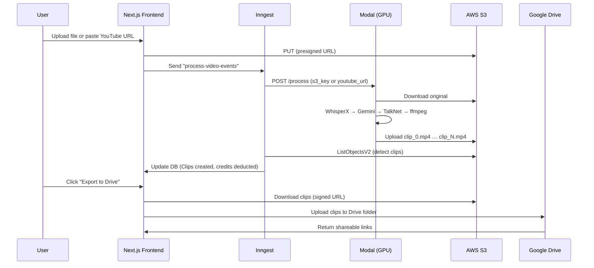

# DARK-PHOENIX: Complete Deployment Plan

## Overview

**Project:** AI Podcast Clipper — end-to-end pipeline from raw video/YouTube to watermarked vertical clips delivered to Google Drive.

**Stack:** Next.js 14 (App Router) · Inngest · Modal (GPU) · WhisperX · Gemini · TalkNet · ffmpeg · Supabase Postgres (Prisma) · AWS S3

**Branch:** `feature/complete-deployment`

---

## Current State (Baseline)

| Component | Status |
|-----------|--------|
| File upload → S3 | ✅ Working |
| Inngest queue trigger | ✅ Working |
| WhisperX transcription | ✅ Working |
| Gemini moment selection | ✅ Working |
| TalkNet active speaker detection | ✅ Working |
| Vertical video + subtitles | ✅ Working |
| Clip playback via signed S3 URL | ✅ Working |
| Credits + Stripe billing | ✅ Working |
| YouTube ingestion | ❌ Orphaned script, not integrated |
| Watermarking | ❌ Not started |
| Google Drive delivery | ❌ Not started |
| S3 cleanup lifecycle | ❌ Missing |
| Credit refund on failure | ❌ Missing |
| Pagination for S3 list | ❌ Missing (fails >1000 objects) |

---

## Phase 1 — Infrastructure Hardening

**Goal:** Fix all known production gaps before adding new features.

### 1.1 Backend Fixes (`ai-podcast-clipper-backend/main.py`)

#### Remove 5-clip ceiling
- **File:** `main.py:432`
- **Change:** Remove `clip_moments[:5]` slice; make max clips configurable via env var `MAX_CLIPS` (default 10)
- **Success:** Processing a 90-min podcast yields >5 clips when Gemini identifies them

#### Credit refund on failure
- **File:** `src/inngest/functions.ts:131-139`
- **Change:** In the error handler, if credits were deducted (step already ran), issue a compensating `prisma.user.update` to restore `clipsFound` credits
- **Success:** User credits unchanged after a Modal failure

#### Paginate S3 ListObjects
- **File:** `src/inngest/functions.ts:153`
- **Change:** Replace single `ListObjectsV2Command` with paginated loop using `ContinuationToken`
- **Success:** Correctly finds clips when folder contains >1000 objects

#### Expand accepted video formats
- **File:** `src/components/dashboard-client.tsx:138`
- **Change:** Add `video/quicktime`, `video/x-matroska`, `video/webm` to dropzone `accept`; update S3 presigned URL action to derive extension from MIME type
- **Success:** User can upload `.mov`, `.mkv`, `.webm` files

#### Fix typos
- **Files:** `dashboard-client.tsx:84`, `billing/page.tsx:130`, `dashboard-client.tsx:273`, `auth.ts:61`
- **Change:** Fix "Upload filed", "credtis", "minuntes", "occured"
- **Success:** No visible spelling errors in UI

### 1.2 S3 Lifecycle Policy

- **Where:** AWS Console or Terraform/CDK config (outside repo)
- **Change:** Add lifecycle rule to expire objects under `*/original.*` prefix after 7 days; keep `*/clip_*.mp4` for 30 days
- **Document:** Add `infra/s3-lifecycle.json` with the lifecycle rule JSON for reproducibility
- **Success:** S3 costs decrease; original uploads auto-expire

### 1.3 Security Hardening

- **Auth token rotation:** Document rotation procedure in `docs/ops.md`; add `AUTH_TOKEN` to Modal secrets via `setup_modal_secret.py` (already exists — verify it's in CI)
- **AWS credentials:** Switch from static IAM user keys to IAM role + short-lived STS tokens for S3 presigned URL generation
- **Rate limiting:** Add Inngest global concurrency cap (separate from per-user) to prevent abuse

### 1.4 Error Scenarios (Phase 1)

| Scenario | Expected Behavior |
|----------|------------------|
| Modal timeout (>3600s) | Inngest catches fetch error → status="failed", credits refunded |
| S3 upload fails mid-clip | Backend logs error per clip; remaining clips still uploaded |
| Gemini returns malformed JSON | `main.py:418-424` parser catches; status="failed" with descriptive message |
| User has 0 credits | Inngest `check-credits` step → status="no credits", no Modal call made |
| WhisperX OOM | Modal kills container → Inngest fetch throws → credits refunded |

---

## Phase 2 — YouTube Ingestion

**Goal:** Accept YouTube URLs as an alternative to file upload.

### 2.1 Frontend Changes

#### New URL input field
- **File:** `src/components/dashboard-client.tsx`
- **Change:** Add tab switcher "Upload File" / "YouTube URL"; URL tab shows `<input type="url" placeholder="https://youtube.com/watch?v=...">` and a "Process" button
- **Validation:** Regex check for `youtube.com/watch?v=` or `youtu.be/` before submit

#### New server action
- **File:** `src/actions/youtube.ts` (new)
- **Exports:** `processYouTubeUrl(url: string)` — creates `UploadedFile` DB record with `s3Key=null` (or a placeholder), sends Inngest event with `{ youtubeUrl }` in data

### 2.2 Backend Changes

#### Install `yt-dlp`
- **File:** `ai-podcast-clipper-backend/requirements.txt`
- **Change:** Replace orphaned `pytubefix` in `ytdownload.py` with `yt-dlp` (more maintained, handles age-gated/throttled videos)
- **Modal image:** Add `yt-dlp` to `pip_install` list in `main.py` image definition

#### New download step in pipeline
- **File:** `main.py`
- **Change:** Add `download_from_youtube(url: str, output_path: str)` function using `yt-dlp` Python API; call it at the start of `process_video` when `youtube_url` is present instead of S3 download
- **Upload to S3 after download:** Upload the downloaded file to S3 as `{uuid}/original.mp4` so the rest of the pipeline is unchanged

#### FastAPI endpoint update
- **File:** `main.py:393-408`
- **Change:** Accept optional `youtube_url` in request body; branch between S3 download and yt-dlp download

### 2.3 Inngest Changes

- **File:** `src/inngest/functions.ts`
- **Change:** Pass `youtubeUrl` through event data; include in Modal request body; display source (file vs YouTube) in clip card UI

### 2.4 Success Criteria (Phase 2)

- User pastes `https://www.youtube.com/watch?v=<id>` → clips generated and displayed
- `yt-dlp` fetches best available 1080p MP4
- Videos up to 3 hours process without timeout (may require timeout increase or chunked processing)
- Invalid/private/deleted URLs surface a clear error message in the UI

### 2.5 Error Scenarios (Phase 2)

| Scenario | Expected Behavior |
|----------|------------------|
| Private/deleted video | yt-dlp raises `DownloadError` → status="failed", UI shows "Video unavailable" |
| YouTube throttles download | yt-dlp retries with backoff automatically |
| Video >3 hours | Pre-check duration before processing; return error "Video too long (max 3h)" |
| Age-gated video | yt-dlp with cookies support; document cookie injection in ops runbook |
| Non-YouTube URL submitted | Frontend regex rejects before server action called |

---

## Phase 3 — Watermarking

**Goal:** Burn a configurable logo/text watermark into every output clip.

### 3.1 Watermark Asset Management

- **Directory:** `ai-podcast-clipper-backend/assets/`
- **Add:** `watermark.png` — default transparent-background logo (PNG with alpha)
- **Upload to Modal volume:** Include `assets/` directory in Modal image or mount as volume
- **Config env var:** `WATERMARK_ENABLED=true`, `WATERMARK_PATH=/assets/watermark.png`, `WATERMARK_OPACITY=0.8`, `WATERMARK_POSITION=bottom-right` (options: `top-left`, `top-right`, `bottom-left`, `bottom-right`)

### 3.2 Backend Changes

- **File:** `main.py` — extend `create_subtitles_with_ffmpeg()` (lines 152–236)
- **New step after subtitles:** Apply watermark via ffmpeg `overlay` filter

```
# Position mapping (1080x1920)
positions = {
    "top-left":     "10:10",
    "top-right":    "W-w-10:10",
    "bottom-left":  "10:H-h-10",
    "bottom-right": "W-w-10:H-h-10",
}

# ffmpeg command addition
-vf "ass=subtitles.ass,movie=watermark.png,scale=200:-1[wm];[in][wm]overlay={position}:alpha={opacity}"
```

- **Conditional:** Only apply if `WATERMARK_ENABLED=true` (allows disabling per environment)

### 3.3 Frontend Changes

- **File:** `src/components/clip-display.tsx`
- **Add:** Small "Watermarked" badge on clip cards when watermark is active (driven by env var exposed to frontend)
- **Settings page:** Future — per-user watermark toggle (Phase 6 scope)

### 3.4 Success Criteria (Phase 3)

- Every clip output has watermark in configured corner
- Watermark opacity readable but not obtrusive
- Disabling `WATERMARK_ENABLED` produces clean clips
- Watermark survives the subtitle ffmpeg pass (applied after, not before)

### 3.5 Error Scenarios (Phase 3)

| Scenario | Expected Behavior |
|----------|------------------|
| `watermark.png` missing | ffmpeg overlay fails → log warning, proceed without watermark (degraded gracefully) |
| Watermark larger than frame | Scale filter auto-resizes to max 200px width |
| `WATERMARK_ENABLED` unset | Default to `false` (no watermark) |

---

## Phase 4 — Google Drive Delivery

**Goal:** After clip generation, automatically upload all clips to a user-specified Google Drive folder and return shareable links.

### 4.1 OAuth Integration

- **Library:** `@googleapis/drive` (Node.js, frontend side)
- **Auth flow:** OAuth 2.0 with `drive.file` scope (minimal — only files this app creates)
- **Storage:** Store `access_token` + `refresh_token` in DB (new `GoogleDriveCredential` table)
- **Schema change** (`prisma/schema.prisma`):

```prisma
model GoogleDriveCredential {
  id           String   @id @default(cuid())
  userId       String   @unique
  accessToken  String
  refreshToken String
  expiresAt    DateTime
  user         User     @relation(fields: [userId], references: [id], onDelete: Cascade)
}
```

### 4.2 OAuth Flow

- **New API routes:**
  - `GET /api/auth/google-drive` — redirect to Google OAuth consent screen
  - `GET /api/auth/google-drive/callback` — exchange code for tokens, store in DB
- **New server action:** `src/actions/google-drive.ts`
  - `connectGoogleDrive()` — initiates OAuth redirect
  - `getGoogleDriveStatus()` — returns connected/disconnected + folder name
  - `uploadClipsToGoogleDrive(uploadedFileId: string)` — drives upload for all clips of a processed video

### 4.3 Upload Logic

- **File:** `src/actions/google-drive.ts`
- **Flow:**
  1. Fetch `Clip[]` for the `UploadedFileId`
  2. For each clip: get S3 signed URL → stream download → stream upload to Drive (`drive.files.create` with `uploadType=multipart`)
  3. Set file permission to `reader`/`anyone` for shareable link
  4. Store Drive file ID + shareable link in `Clip.driveFileId` (new DB field)
- **Folder:** Create a folder per `UploadedFile` named `{displayName} - Dark Phoenix Clips`, upload all clips inside

### 4.4 Frontend Changes

- **File:** `src/components/clip-display.tsx`
- **Add:** "Export to Drive" button per processed video (not per individual clip)
- **Add:** Google Drive connection status in dashboard header/settings
- **Add:** Drive link icon on each clip card after export completes

### 4.5 Success Criteria (Phase 4)

- User connects Google Drive once via OAuth
- After processing, "Export to Drive" button uploads all clips to a named Drive folder
- Each clip card shows a "Open in Drive" link
- Token refresh handled automatically (no re-auth required for 6 months)

### 4.6 Error Scenarios (Phase 4)

| Scenario | Expected Behavior |
|----------|------------------|
| Token expired, refresh fails | UI prompts re-authentication |
| Drive quota exceeded | Surface error "Google Drive storage full"; clips still available in S3 |
| Network interruption mid-upload | Retry up to 3 times with exponential backoff |
| User revokes Drive access | Next export attempt detects 401 → prompt re-auth |
| Drive API rate limit | Queue uploads with 1s delay between files |

---

## Phase 5 — End-to-End Testing

**Goal:** Automated test coverage for every critical path before shipping.

### 5.1 Frontend Tests

- **Framework:** Playwright (E2E) + Vitest (unit)
- **Test files location:** `ai-podcast-clipper-frontend/tests/`

| Test | Coverage |
|------|----------|
| `upload.spec.ts` | File upload → Inngest event fired → DB record created |
| `youtube.spec.ts` | YouTube URL input → validation → event fired |
| `credits.spec.ts` | Credits deducted after processing; refunded on failure |
| `drive.spec.ts` | OAuth connect → export → link appears in UI |
| `billing.spec.ts` | Stripe checkout → credit increment |

### 5.2 Backend Tests

- **Framework:** `pytest`
- **Test files location:** `ai-podcast-clipper-backend/tests/`

| Test | Coverage |
|------|----------|
| `test_transcription.py` | WhisperX produces word-level segments from fixture audio |
| `test_gemini.py` | Gemini JSON parsing handles code fences + malformed output |
| `test_watermark.py` | ffmpeg overlay command constructed correctly; output file exists |
| `test_youtube.py` | yt-dlp downloads valid URL; raises on private video |
| `test_pipeline.py` | Full pipeline on 60-second fixture video; at least 1 clip generated |

### 5.3 CI Pipeline

- **File:** `.github/workflows/ci.yml` (new)
- **Stages:**
  1. Lint (ESLint + Ruff)
  2. Type check (tsc + mypy)
  3. Unit tests (Vitest + pytest with fixtures, no GPU)
  4. E2E tests (Playwright against local dev server with mocked Modal)

### 5.4 Success Criteria (Phase 5)

- All tests pass in CI on every PR to `main`
- E2E covers the full upload → clip → drive flow
- Backend unit tests run without GPU (use fixture transcriptions)

---

## Phase 6 — Documentation

**Goal:** Every developer and operator can onboard without asking questions.

### 6.1 Files to Create

| File | Contents |
|------|----------|
| `docs/architecture.md` | System diagram (Mermaid), component responsibilities, data flow |
| `docs/setup.md` | Local dev setup: env vars, Prisma migrate, Modal deploy, Inngest dev server |
| `docs/ops.md` | Rotating secrets, S3 lifecycle management, Modal GPU scaling, incident runbook |
| `docs/api.md` | All Next.js API routes, server actions, request/response shapes |
| `CONTRIBUTING.md` | Branch naming, PR process, test requirements |

### 6.2 Architecture Diagram (Mermaid)



### 6.3 Success Criteria (Phase 6)

- New developer can run `npm run dev` + Modal dev server from `docs/setup.md` alone
- Ops runbook covers every known failure mode from Phases 1–4
- All env vars documented with example values

---

## Execution Order & Dependencies

```
Phase 1 (Infrastructure) ──┐
                            ├──► Phase 2 (YouTube) ──────┐
                            ├──► Phase 3 (Watermark) ────┤
                            └──► Phase 4 (Google Drive) ─┤
                                                          ▼
                                                   Phase 5 (Testing)
                                                          │
                                                          ▼
                                                   Phase 6 (Docs)
```

Phases 2, 3, and 4 are **independent** and can be developed in parallel after Phase 1 is complete. Phase 5 runs continuously (tests added alongside each feature). Phase 6 is written last.

---

## Success Criteria Summary

| Phase | Done When |
|-------|-----------|
| 1 | All bugs fixed; no typos; S3 lifecycle in place; formats beyond MP4 accepted |
| 2 | YouTube URL → clips in UI; yt-dlp integrated in Modal image |
| 3 | Every clip has watermark overlay; configurable position/opacity |
| 4 | Drive OAuth connected; "Export to Drive" creates folder + shareable links |
| 5 | CI green on all tests; E2E covers full happy path |
| 6 | Any engineer can onboard from docs alone |

---

## Open Questions

1. **YouTube auth:** Do we need yt-dlp cookies for age-gated content, or is public-only sufficient for MVP?
2. **Watermark asset:** What logo/image file should be used? Who owns it?
3. **Drive folder ownership:** Should clips go to the user's personal Drive or a shared team Drive?
4. **Credit model for YouTube:** Same credit cost as file upload (per clip generated)?
5. **Max video length:** Should YouTube ingestion have a different limit than file upload (e.g., 3h vs 500MB)?
6. **Multi-language subtitles:** WhisperX supports other languages — expose this in Phase 1 or later?
